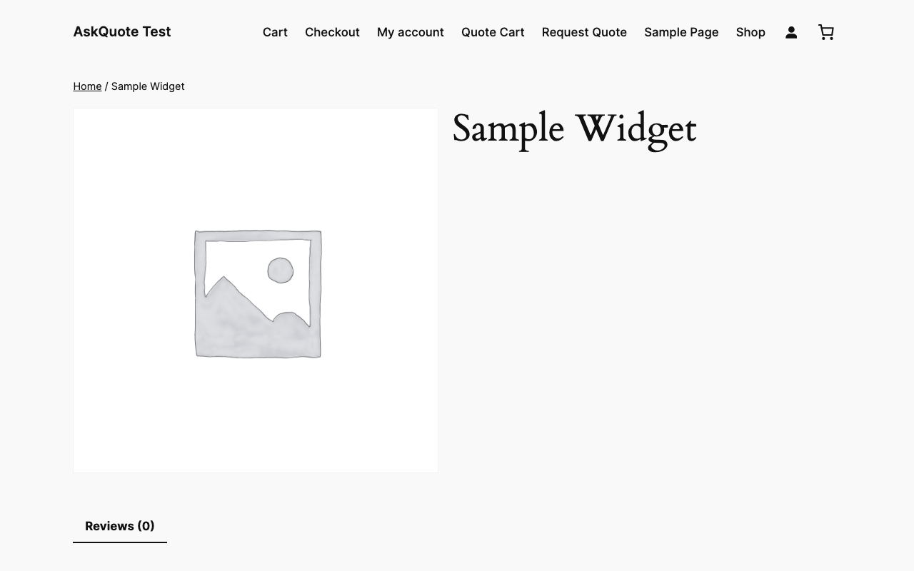
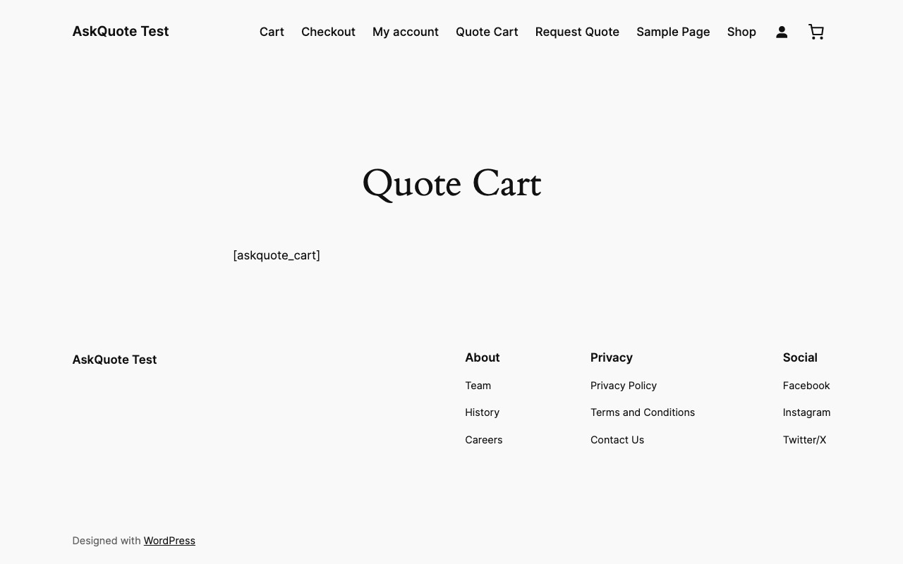
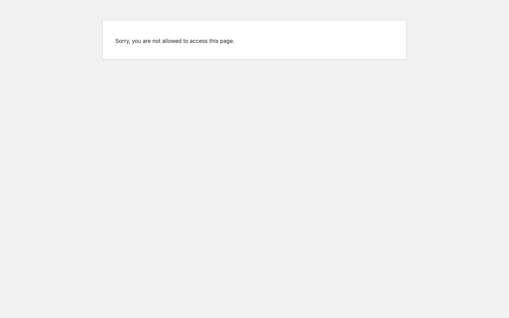
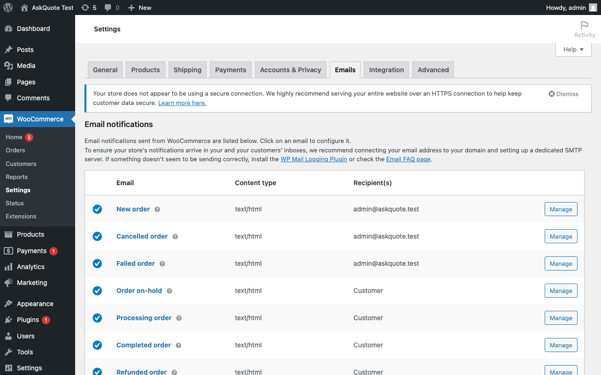

# AskQuote for WooCommerce

> Add a complete **Request a Quote** workflow to your WooCommerce store — in minutes, not days.

[](https://www.gnu.org/licenses/gpl-2.0.html)
[](https://wordpress.org)
[](https://woocommerce.com)
[](https://php.net)

Customers click **"Request Quote"** on any product, build a quote cart, and submit their request. You review and approve it from your WordPress dashboard — no coding required.

---

## ✨ Features

- **Quote button** on any product page — control which products show it (all, by category, by tag, or per-product)
- **Dedicated quote cart** — completely separate from the WooCommerce shopping cart
- **Quote submission form** — captures customer details alongside quoted items
- **Admin dashboard** — manage all incoming quotes with status tabs, bulk actions, and a detail view
- **Custom statuses** — Pending → Replied → Approved → Closed
- **Email notifications** — customer confirmation, admin new-quote alert, and customer approval notice (all using your WooCommerce email template)
- **My Account integration** — logged-in customers see a "My Quotes" tab
- **REST API** — full API at `/wp-json/askquote/v1/quotes` for headless and external integrations
- **HPOS compatible** — works with WooCommerce High-Performance Order Storage
- **Zero telemetry** — no analytics, no remote connections, no data sent anywhere

---

## 📸 Screenshots

| Quote button on product | Quote cart | Submission form |
|---|---|---|
|  |  |  |

| Admin quotes list | Quote detail & approval |
|---|---|
|  |  |

---

## 🚀 Quick Start

### Install

**Option A — Download ZIP (recommended)**

1. Download the latest ZIP from the [Releases page](https://github.com/arunrajiah/askquote-for-woocommerce/releases/latest)
2. Go to **WordPress Admin → Plugins → Add New → Upload Plugin**
3. Upload the ZIP and click **Activate**

**Option B — Manual**

1. Extract the ZIP into `/wp-content/plugins/askquote-for-woocommerce/`
2. Activate via **WordPress Admin → Plugins**

### Configure

1. Go to **AskQuote → Settings** and choose which products show the quote button
2. Create a **Quote Cart** page, add the `[askquote_cart]` shortcode, and save its ID in settings
3. Create a **Quote Form** page, add the `[askquote_form]` shortcode, and save its ID in settings
4. Optionally go to **WooCommerce → Settings → Emails** to customise the AskQuote email subjects

That's it — the quote button will now appear on your products.

---

## 📌 Shortcodes

| Shortcode | Description |
|-----------|-------------|
| `[askquote_button product_id="123"]` | Render the quote button for a specific product anywhere on the site |
| `[askquote_cart]` | Display the current quote cart (use on a dedicated "Quote Cart" page) |
| `[askquote_form]` | Display the quote submission form |

---

## ❓ FAQ

**Does this work with variable products?**  
Yes. Variation IDs are tracked in the quote cart and saved against each quote line item.

**Will this break my regular cart or checkout?**  
No. The quote cart is completely independent — stored separately in the WooCommerce session.

**Can I add custom fields to the quote form?**  
Yes — use the `askquote_quote_form_fields` filter. See the [Hooks reference](#-hooks-for-developers) below.

**Can customers see their past quotes?**  
Yes. Logged-in customers get a "My Quotes" tab in their WooCommerce My Account area.

**Can I control which products show the button?**  
Yes. Go to **AskQuote → Settings → General** and choose: all products, specific categories, specific tags, or per-product toggle.

**Where are advanced features like PDF quotes, price negotiation, and expiry dates?**  
Those are part of [AskQuote Pro](https://hub.arunrajiah.com/products/askquote-pro) — available separately.

---

## ⚡ AskQuote Pro

The free plugin handles the core quoting workflow. **[AskQuote Pro](https://hub.arunrajiah.com/products/askquote-pro)** ($49 one-time) adds B2B-grade features:

- Wholesale roles & tiered pricing rules
- Bulk order form with CSV import
- Net-30 checkout & invoice generation
- B2B registration with approval workflow
- Tax exemption management
- Quote templates for fast replies
- Priority email support · 1-year updates

---

## 🔧 Hooks for Developers

AskQuote is built to be extended. Key hooks:

| Hook | Type | Description |
|------|------|-------------|
| `askquote_loaded` | action | Fires after the plugin has fully initialised |
| `askquote_quote_submitted` | action | Fires after a new quote is saved |
| `askquote_quote_status_changed` | action | Fires on every status transition |
| `askquote_quote_button_visible` | filter | Control per-product button visibility |
| `askquote_quote_button_html` | filter | Customise the button HTML output |
| `askquote_quote_form_fields` | filter | Add, remove, or reorder form fields |
| `askquote_quote_data_before_save` | filter | Modify quote data before it is written to the DB |
| `askquote_email_recipients` | filter | Customise who receives each email type |

See [`includes/extensibility/class-hook-registry.php`](includes/extensibility/class-hook-registry.php) for the complete documented list.

### Overriding Templates

Copy any file from `templates/` into your theme at the same relative path under `askquote-for-woocommerce/`:

```
wp-content/themes/your-theme/
  askquote-for-woocommerce/
    emails/
      customer-quote-submitted.php
    frontend/
      quote-form.php
```

### REST API

Base URL: `{site_url}/wp-json/askquote/v1`

| Method | Endpoint | Auth |
|--------|----------|------|
| `POST` | `/quotes` | None (public) |
| `GET` | `/quotes` | `manage_woocommerce` |
| `GET` | `/quotes/{id}` | Admin or quote owner |
| `PATCH` | `/quotes/{id}/status` | `manage_woocommerce` |

---

## 🛠 Local Development

```bash
git clone https://github.com/arunrajiah/askquote-for-woocommerce.git
cd askquote-for-woocommerce

# Install dev tools
composer install

# Install WordPress test suite
bash bin/install-wp-tests.sh wordpress_test root '' localhost latest

# Run tests
composer run test

# Lint (PHPCS)
composer run lint

# Auto-fix lint issues
composer run lint-fix
```

### Project Layout

```
askquote-for-woocommerce/
├── askquote-for-woocommerce.php   Main plugin file
├── includes/
│   ├── admin/           Admin screens, settings, list table, meta box
│   ├── frontend/        Quote button, cart, form, My Account tab
│   ├── post-types/      CPT registration
│   ├── emails/          WC_Email subclasses + email manager
│   ├── api/             REST API controller
│   ├── helpers/         Global functions, status helper
│   └── extensibility/   Hook documentation class
├── templates/           Overridable templates (emails + frontend)
├── assets/              CSS and JS
├── languages/           .pot translation template
└── tests/               PHPUnit bootstrap and test cases
```

### Release Process

1. Update version in `askquote-for-woocommerce.php`, `class-askquote.php`, `readme.txt`, and `CHANGELOG.md`
2. Commit and push to `main`
3. Tag the release: `git tag v1.x.x && git push --tags`
4. GitHub Actions automatically builds and attaches the ZIP to the release

---

## 📄 License

GPL v2 or later — see [LICENSE](LICENSE).

Copyright © 2026 [Arun Rajiah](https://hub.arunrajiah.com)
